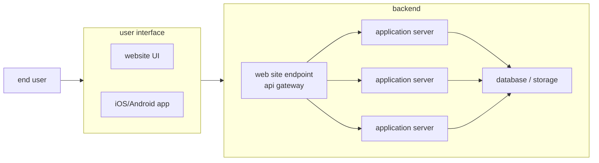

# 什麼是後端工程師

通常一個普通的 web app、會有如上的架構。
使用者會透過 網頁/手機app 等比較簡易的圖形化操作介面、來與後端的 網站/api 做溝通。

而後端的部分、則負責將接收到的使用者的需求、透過 application server 來和對應資料庫或是儲存裝置進行交互作用（基本上不脫 CRUD 等操作）。最後 application server 會再將操作的結果回覆給發出請求的使用者。

上面圖中被 backend 那個方塊框起來的部分，一般就是後端工程師負責處理的部分。